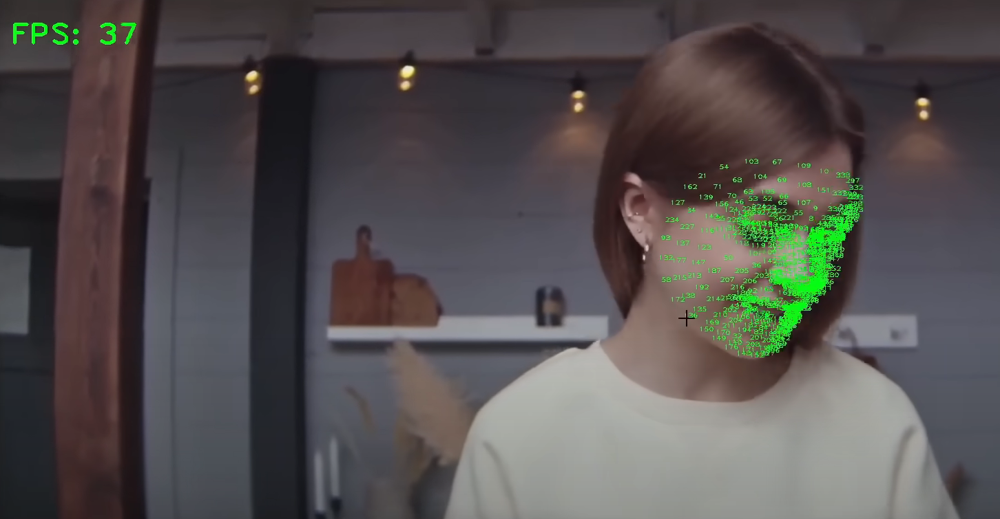

# Real-time Face Mesh Detection with MediaPipe and OpenCV

This project utilizes MediaPipe and OpenCV to perform real-time face mesh detection using a webcam feed. The program captures video frames and processes them using the MediaPipe Face Mesh module to detect facial landmarks and contours. These detected landmarks are then visualized on the frame, allowing for detailed analysis of facial features and expressions. 

